# 🛡️ hardening-linux-lvl3 — Durcissement Linux (niveau 3)

> Suite des TP `hardening-linux-lvl1` et `hardening-linux-lvl2`. Je reprends **la même machine Arch Linux** déjà durcie aux niveaux 1 et 2, et je construis par-dessus une version **améliorée** proposant trois mesures complémentaires : un **service SSH** renforcé, un **service web Apache/PHP en HTTPS**, et un **pare-feu iptables** complet. Ce README est un tutoriel reproductible : pour chaque mesure, j'indique le **but**, mes **choix justifiés**, la **commande** exécutée, la **capture** correspondante, une **explication**, et le **lien de documentation** utilisé.

---

## 1. Identité du projet

**Nom :** hardening-linux-lvl3
**Code interne :** `SEC-LNX-003`
**Type :** travaux pratiques de sécurité système (durcissement Linux, niveau 3), en environnement virtualisé.
**Socle :** la machine Arch Linux issue du TP niveau 2 (noyau conforme ANSSI avec blocage du chargement de modules, PAM durci, `auditd`, SSH par clé + OTP, `/boot` en lecture seule, `sudo` par OTP, second volume chiffré `/data` LUKS/LVM, réseau `systemd-networkd` fixe `10.10.10.10`).
**Documentation de référence :** le **wiki Arch Linux** (`https://wiki.archlinux.org`), le **générateur de configuration SSL de Mozilla** (`https://ssl-config.mozilla.org`) et les **recommandations TLS de l'ANSSI**.

## 2. Contexte et objectifs

Là où le niveau 2 durcissait le système lui-même, le niveau 3 le fait **rendre un service** tout en restant maîtrisé. J'ajoute trois blocs :

- **Service SSH :** je pousse la configuration du démon au-delà du 2FA déjà en place — port d'écoute déplacé, écoute IPv4 uniquement, SSH v2 seul, coupure au premier échec ou après 30 secondes, suppression du forwarding TCP/X11, désactivation de l'authentification par hôte et des variables d'environnement utilisateur, déconnexion sur inactivité, suppression du KeepAlive, et algorithmes cryptographiques modernes.
- **Service HTTP (Apache httpd) :** hébergement d'une page PHP `Hello World`, en **HTTPS** avec un certificat conforme aux standards actuels, publication depuis `/data/http/www` (le volume chiffré), écoute **IPv4 uniquement** sur les ports **8080 et 443**, **redirection applicative** du HTTP vers le HTTPS, et **aucune information de version** dans les en-têtes.
- **Pare-feu iptables :** politique par défaut `DROP`, filtrage précis en entrée et en sortie, redirection réseau du port 80 vers 8080, **journalisation intégrale** des flux avec des entêtes distincts, lancement en service au démarrage, et une surface d'écoute réduite à **3 ports en IPv4**.

## 3. Environnement technique

**Système :** Arch Linux (impératif — la documentation de référence est le wiki Arch).
**Virtualisation :** Hyper-V (VM de génération 2). La console **VMConnect** sert de filet anti-verrouillage à chaque opération risquée sur SSH ou le pare-feu.
**Réseau :** commutateur interne Hyper-V, adressage fixe `10.10.10.0/24`, la machine portant `10.10.10.10` et la **machine d'administration** (poste Windows) `10.10.10.1`.
**Poste d'administration :** un poste Windows, depuis lequel j'administre la VM en SSH (client OpenSSH sous PowerShell) et je teste le service web (`curl.exe`, `ping`).

## 4. Méthode de travail

Je conserve la méthode des niveaux précédents : je réalise moi-même chaque manipulation, **une action à la fois**, en citant la page de documentation pertinente. Chaque commande est capturée et justifiée. Je traite chaque erreur comme un **incident** que je cherche à comprendre (cause → correctif → documentation) plutôt qu'à contourner ; l'ensemble est repris dans `JOURNAL-INCIDENTS.md`. Deux principes de sûreté guident les opérations sensibles : je **garde toujours une session de secours ouverte** (voire la console Hyper-V) avant de recharger SSH ou d'appliquer le pare-feu, et je **teste toute nouveauté depuis une seconde connexion** avant de la rendre définitive. Aucun secret n'apparaît en clair dans le dépôt, et les captures sont nettoyées des éléments sensibles.

## 5. Nomenclature des captures

Les captures sont regroupées dans le dossier `Screenshots/` et nommées `TP3-EtapeXX-NomTache.png`. Chaque section ci-dessous référence les captures qui l'illustrent. J'ai volontairement conservé aussi les captures d'**incidents** et de leur **correctif**, car elles font partie de la démarche.

---

## 6. Bloc 1 — Durcissement du service SSH

### 6.1 État initial et cohérence du port

**But :** partir de l'état connu du TP2 (authentification `publickey,keyboard-interactive` = clé + OTP, sans mot de passe) avant d'y superposer les exigences du niveau 3.

**Point de cohérence assumé :** l'énoncé demande de déplacer l'écoute sur le port « 22222 ». Après vérification, il s'agit d'une **coquille** : le port retenu est **`2222`** (quatre chiffres), valeur que j'utilise partout — y compris, plus loin, dans la règle de pare-feu autorisant le SSH. Cette décision est documentée dans le journal d'incidents.

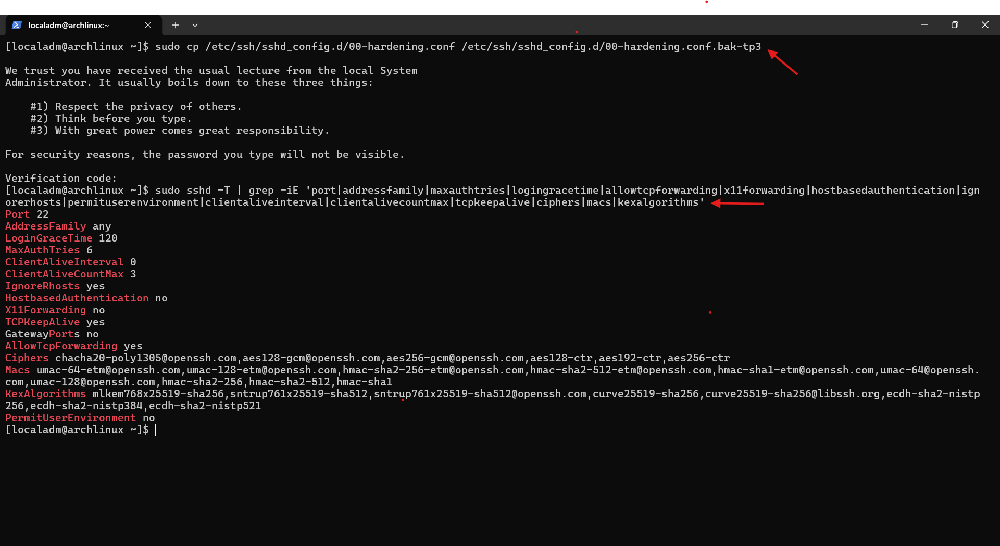

### 6.2 Configuration cible

**But :** répondre à l'ensemble des exigences SSH de l'énoncé en un seul bloc de durcissement, ajouté au fichier `/etc/ssh/sshd_config.d/00-hardening.conf` hérité du TP2.

**Choix justifiés :** je conserve la base TP2 (pas de mot de passe, `publickey,keyboard-interactive`, `PermitRootLogin no`) et j'ajoute le bloc niveau 3 ci-dessous. Chaque directive répond à un besoin précis de l'énoncé.

```bash
# ================= Durcissement TP3 =================
Port 2222
AddressFamily inet
MaxAuthTries 2
LoginGraceTime 30
ClientAliveInterval 90
ClientAliveCountMax 0
TCPKeepAlive no
AllowTcpForwarding no
X11Forwarding no
PermitTunnel no
HostbasedAuthentication no
IgnoreRhosts yes
PermitUserEnvironment no
Ciphers chacha20-poly1305@openssh.com,aes256-gcm@openssh.com,aes128-gcm@openssh.com
MACs hmac-sha2-512-etm@openssh.com,hmac-sha2-256-etm@openssh.com,umac-128-etm@openssh.com
KexAlgorithms sntrup761x25519-sha512@openssh.com,curve25519-sha256,curve25519-sha256@libssh.org,diffie-hellman-group16-sha512,diffie-hellman-group18-sha512
```

**Explication, directive par directive :**

- **`Port 2222`** : déplace l'écoute, ce qui réduit le bruit des scans automatisés visant le 22.
- **`AddressFamily inet`** : n'écoute **qu'en IPv4**, conformément à l'exigence « IPv4 uniquement ».
- **SSH v2 uniquement** : les versions modernes d'OpenSSH ont **abandonné le protocole 1** ; l'écoute est donc de facto en v2 seul, ce que confirme `sshd -T`.
- **`MaxAuthTries 2`** : coupe l'authentification dès le premier essai réellement échoué. La valeur `2` (et non `1`) est un point subtil : la double méthode `publickey,keyboard-interactive` **consomme deux tentatives** (clé puis OTP) ; `MaxAuthTries 1` interdirait donc toute connexion légitime. Cet ajustement est détaillé dans le journal.
- **`LoginGraceTime 30`** : ferme la connexion si l'authentification n'aboutit pas en 30 secondes.
- **`ClientAliveInterval 90` + `ClientAliveCountMax 0`** : déconnecte l'utilisateur après **1 min 30 d'inactivité** (une sonde, zéro toléré).
- **`TCPKeepAlive no`** : le serveur ne propose pas de KeepAlive TCP.
- **`AllowTcpForwarding no`, `X11Forwarding no`, `PermitTunnel no`** : suppriment tout forwarding TCP, X11 et tunnel.
- **`HostbasedAuthentication no` + `IgnoreRhosts yes`** : désactivent l'authentification basée sur l'hôte et ignorent les fichiers `.rhosts`.
- **`PermitUserEnvironment no`** : interdit à l'utilisateur d'injecter des variables d'environnement à l'ouverture de session.
- **`Ciphers` / `MACs` / `KexAlgorithms`** : ne retiennent que des algorithmes modernes (AEAD ChaCha20-Poly1305 et AES-GCM, MAC en Encrypt-then-MAC, échanges de clés à courbes elliptiques et post-quantique `sntrup761x25519`), conformément aux standards actuels.

**Documentation :** https://wiki.archlinux.org/title/OpenSSH#Hardening et https://man.archlinux.org/man/sshd_config.5

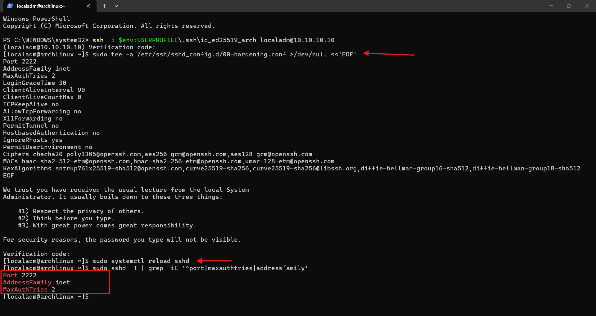

### 6.3 Application prudente et test sur le port 2222

**But :** appliquer le nouveau bloc **sans se verrouiller dehors**, puis prouver que la connexion fonctionne sur le nouveau port.

**Commande :**

```bash
sudo sshd -t && echo "== SYNTAXE OK ==" && sudo systemctl reload sshd
# depuis un NOUVEL onglet PowerShell, sans fermer la session courante :
ssh -p 2222 -i $env:USERPROFILE\.ssh\id_ed25519_arch localadm@10.10.10.10
```

**Explication :** je valide d'abord la syntaxe (`sshd -t`) — un fichier invalide empêcherait `sshd` de redémarrer — puis je recharge le service **sans couper** ma session active, et je teste le port `2222` depuis une **seconde** connexion (clé + OTP). La session d'origine reste mon filet de secours tant que la nouvelle n'a pas abouti.

**Documentation :** https://wiki.archlinux.org/title/OpenSSH#Daemon_management

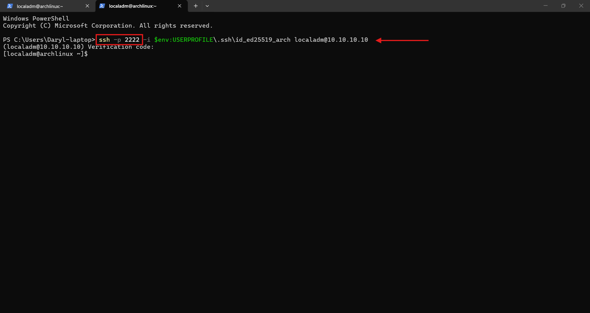

---

## 7. Bloc 2 — Service HTTP : Apache + PHP-FPM + HTTPS

### 7.1 Installation et répertoire de publication

**But :** installer Apache et préparer le répertoire de publication `/data/http/www`, appartenant à l'utilisateur qui initie le service.

**Choix justifiés :** je publie le site **sur le volume chiffré `/data`** (hérité du TP2), ce qui protège le contenu web au repos. Le serveur Apache s'exécute sous l'utilisateur `http` ; le répertoire `/data/http` lui appartient donc et reste en `700` (durcissement `umask` du TP2 oblige), ce qui est **plus restrictif** que le défaut sans gêner le service. J'y dépose le `index.php` exigé.

**Commandes :**

```bash
sudo pacman -S --noconfirm apache php php-fpm
sudo mkdir -p /data/http/www
sudo chown -R http:http /data/http
sudo tee /data/http/www/index.php > /dev/null <<'EOF'
<?php
        printf("<h1>Hello World !</h1>");
?>
EOF
```

**Explication :** `chown http:http` fait du compte de service le propriétaire du répertoire de publication, comme le demande l'énoncé (« le répertoire doit appartenir à l'utilisateur initiant le service »). Le fichier `index.php` contient exactement le code fourni par l'énoncé.

**Documentation :** https://wiki.archlinux.org/title/Apache_HTTP_Server

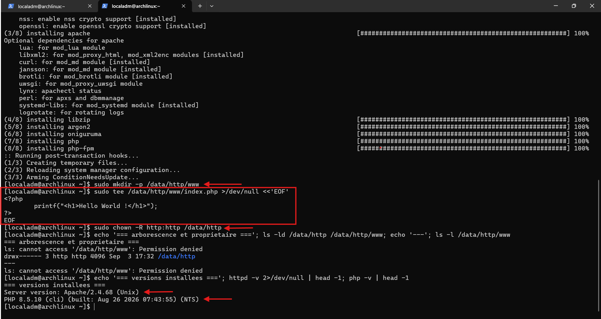

### 7.2 Modules et configuration Apache

**But :** activer les modules nécessaires (SSL, cache TLS, proxy FastCGI vers PHP, réécriture d'URL, en-têtes) et isoler ma configuration dans un fichier dédié inclus par `httpd.conf`.

**Choix justifiés :** plutôt que d'éditer lourdement `httpd.conf`, je n'y décommente que les `LoadModule` requis, je neutralise le `Listen 80` par défaut, et j'ajoute une seule ligne `Include conf/extra/httpd-tp3.conf`. Toute ma logique (ports, vhosts, TLS, PHP) tient dans ce fichier séparé, plus lisible et réversible.

**Modules chargés :** `mod_ssl`, `mod_socache_shmcb` (cache de session TLS), `mod_proxy` + `mod_proxy_fcgi` (passerelle vers PHP-FPM), `mod_rewrite` (redirection applicative) et `mod_headers`.

**Documentation :** https://wiki.archlinux.org/title/Apache_HTTP_Server#Configuration

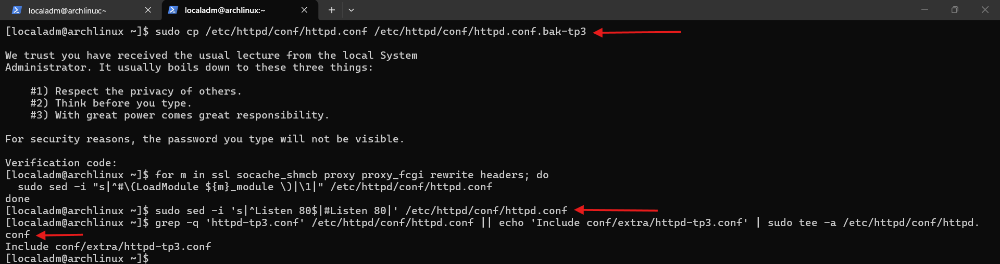

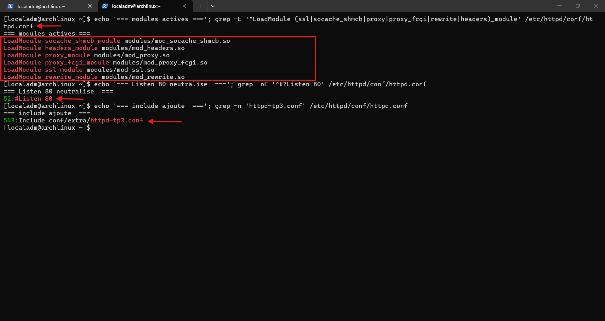

### 7.3 Exécution de PHP via PHP-FPM (`mod_proxy_fcgi`)

**But :** rendre Apache capable d'exécuter du code PHP, via **PHP-FPM** plutôt qu'un module embarqué.

**Choix justifiés :** j'ai retenu l'architecture **`php-fpm` + `mod_proxy_fcgi`** (et non `mod_php`, déprécié et moins isolé). PHP tourne dans son propre gestionnaire de processus, sous l'utilisateur `http`, et Apache lui transmet les requêtes `.php` par une socket Unix (`/run/php-fpm/php-fpm.sock`). C'est l'approche moderne recommandée, qui sépare le serveur web du moteur d'exécution.

**Extrait de `httpd-tp3.conf` (aiguillage PHP) :**

```apache
<FilesMatch \.php$>
    SetHandler "proxy:unix:/run/php-fpm/php-fpm.sock|fcgi://localhost/"
</FilesMatch>
```

**Explication :** toute requête vers un fichier `.php` est déléguée, via `proxy_fcgi`, au démon `php-fpm` à travers sa socket. Apache ne « comprend » pas PHP : il sous-traite l'exécution, ce qui limite sa surface et cloisonne les privilèges.

**Documentation :** https://wiki.archlinux.org/title/Apache_HTTP_Server#PHP

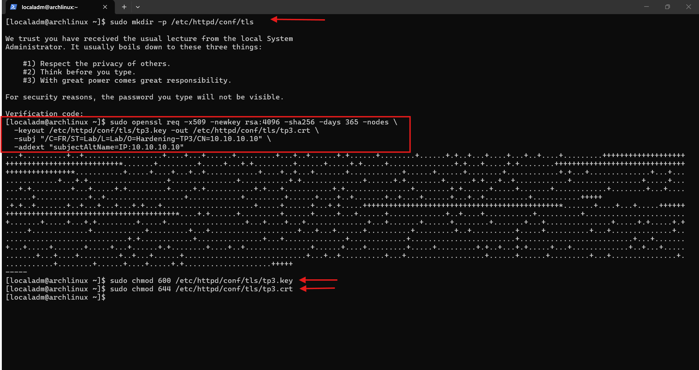

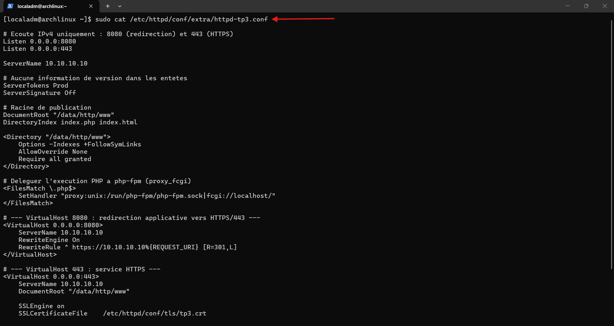

### 7.4 HTTPS, certificat conforme et redirection applicative 80→443

**But :** servir le site en **HTTPS** avec des éléments cryptographiques conformes aux standards actuels, écouter en IPv4 sur **8080 et 443**, et **rediriger** tout le trafic clair vers le HTTPS de manière **applicative**.

**Choix justifiés :** je génère un **certificat auto-signé** RSA 4096 bits (CN et SAN = `10.10.10.10`), suffisant pour un service interne de lab. Pour la configuration TLS, je m'appuie sur le générateur Mozilla et les recommandations ANSSI : j'applique le profil **« Moderne » (TLS 1.3 uniquement)**, tout en **documentant** le profil « Intermédiaire » (TLS 1.2+1.3) qui serait retenu si des clients anciens devaient être supportés — les deux ne pouvant coexister, j'active le plus strict. La redirection HTTP→HTTPS est **applicative** (règle `mod_rewrite` renvoyant un `301`), et non un simple blocage réseau.

**Génération du certificat :**

```bash
sudo mkdir -p /etc/httpd/conf/tls
sudo openssl req -x509 -newkey rsa:4096 -nodes -days 825 \
  -keyout /etc/httpd/conf/tls/tp3.key -out /etc/httpd/conf/tls/tp3.crt \
  -subj "/CN=10.10.10.10" -addext "subjectAltName=IP:10.10.10.10"
sudo chmod 600 /etc/httpd/conf/tls/tp3.key
```

**Extrait de `httpd-tp3.conf` (écoute, vhosts, TLS) :**

```apache
Listen 0.0.0.0:8080
Listen 0.0.0.0:443
ServerName 10.10.10.10
ServerTokens Prod
ServerSignature Off
DocumentRoot /data/http/www

# VHost HTTP (8080) : redirection applicative vers HTTPS
<VirtualHost 0.0.0.0:8080>
    RewriteEngine On
    RewriteRule ^ https://10.10.10.10%{REQUEST_URI} [R=301,L]
</VirtualHost>

# VHost HTTPS (443)
<VirtualHost 0.0.0.0:443>
    SSLEngine on
    SSLCertificateFile    /etc/httpd/conf/tls/tp3.crt
    SSLCertificateKeyFile /etc/httpd/conf/tls/tp3.key
    SSLProtocol -all +TLSv1.3
    SSLHonorCipherOrder off
    SSLSessionTickets off
</VirtualHost>
```

**Test décisif :**

```bash
sudo systemctl enable --now php-fpm httpd
curl -k https://10.10.10.10/        # -> <h1>Hello World !</h1>
curl -I http://10.10.10.10:8080/    # -> 301 + Location: https://10.10.10.10/
```

**Explication :** le premier `curl` prouve d'un coup que **le HTTPS écoute sur 443, que le vhost sert `/data/http/www`, et que PHP-FPM exécute le `.php`** (le `-k` accepte le certificat auto-signé, comportement attendu). Le second prouve la redirection applicative : une requête claire reçoit un `301` vers l'URL HTTPS. Le vhost HTTP écoute sur **8080** (et non 80) car c'est le pare-feu du Bloc 3 qui redirigera le port 80 vers 8080 au niveau réseau.

**Documentation :** https://ssl-config.mozilla.org/ et https://wiki.archlinux.org/title/Apache_HTTP_Server#TLS

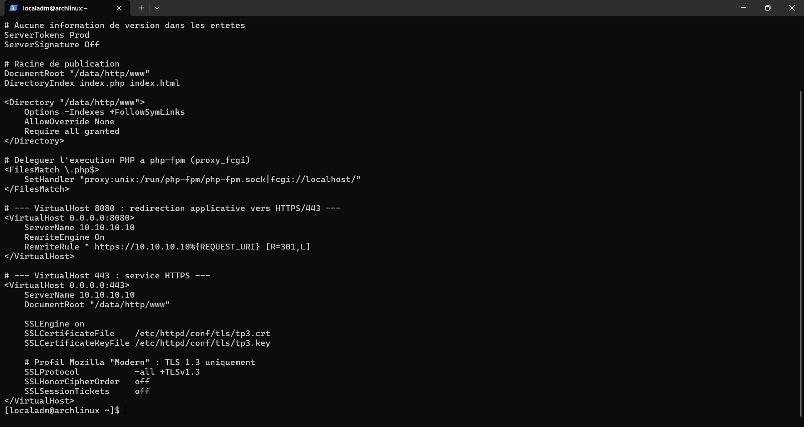

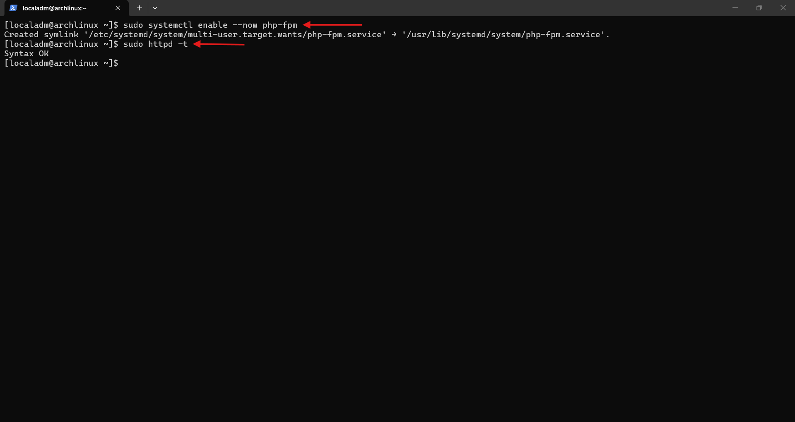

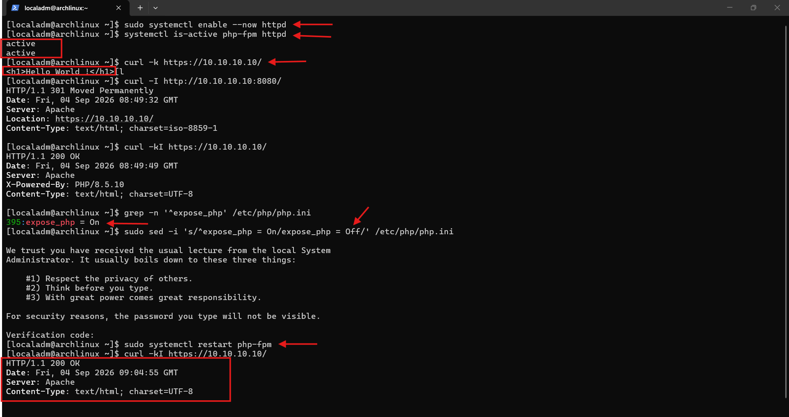

### 7.5 Suppression des informations de version

**But :** ne divulguer **aucune** information de version dans les en-têtes des réponses — ni Apache, ni PHP.

**Choix justifiés :** `ServerTokens Prod` et `ServerSignature Off` (posés dans `httpd-tp3.conf`) réduisent la bannière Apache à `Server: Apache`, sans numéro de version. Mais un en-tête subsistait : **`X-Powered-By: PHP/8.5.10`**, ajouté par PHP lui-même. Je le supprime **à la source** en passant `expose_php = Off` dans `/etc/php/php.ini`.

**Commande :**

```bash
sudo sed -i 's/^expose_php = On/expose_php = Off/' /etc/php/php.ini
sudo systemctl restart php-fpm
curl -kI https://10.10.10.10/   # -> Server: Apache, et plus de X-Powered-By
```

**Explication :** `expose_php = Off` empêche PHP de s'annoncer via `X-Powered-By` (et neutralise aussi ses URL « easter eggs »). Après rechargement, la réponse ne porte plus que `Server: Apache`, sans aucune version — l'objectif « aucune information de version » est atteint sur les deux briques. La découverte de cette fuite est relatée dans le journal.

**Documentation :** https://www.php.net/manual/en/ini.core.php#ini.expose-php

---

## 8. Bloc 3 — Pare-feu iptables

### 8.1 Le piège hérité du TP2 : `modules_disabled`

**But :** comprendre, avant d'écrire la moindre règle, pourquoi iptables ne fonctionne pas d'emblée sur cette machine.

**Constat :** un diagnostic initial révèle que `kernel.modules_disabled = 1` (durcissement du TP2, verrou **irréversible jusqu'au reboot**) est actif, qu'`iptables -L` **échoue** (`Could not fetch rule set generation id`), et qu'**aucun** module netfilter n'est chargé (`lsmod` vide). iptables (backend `nf_tables`) a besoin de modules noyau (`nf_tables`, `nft_compat`, `nf_conntrack`, `nf_nat`, `xt_LOG`, `xt_REDIRECT`…) ; or le verrou interdit tout chargement à chaud.

**Explication :** c'est exactement la même famille de problème que le déchiffrement de `/data` au TP2. La parade sera identique : **précharger** les modules très tôt au démarrage, avant que le verrou ne se repose.

**Documentation :** https://wiki.archlinux.org/title/Iptables et https://wiki.archlinux.org/title/Kernel_module

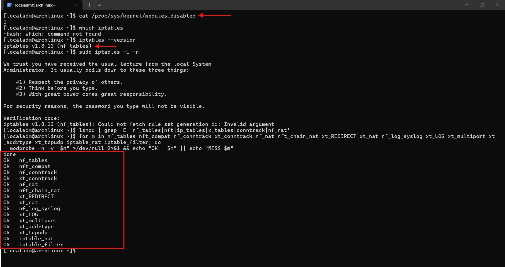

### 8.2 Préchargement des modules netfilter

**But :** rendre disponibles, dès le démarrage, tous les modules dont le pare-feu aura besoin.

**Choix justifiés :** je vérifie d'abord (par un `modprobe -n -v` à blanc) que chaque module candidat existe bien sur ce noyau, puis je liste les modules validés dans `/etc/modules-load.d/tp3-iptables.conf`. Ce fichier est lu par `systemd-modules-load.service` **au tout début** du démarrage (phase `sysinit`), donc **avant** le service `modules-disable` du TP2 qui repose le verrou.

```ini
# /etc/modules-load.d/tp3-iptables.conf
# Coeur nftables + couche de compatibilite iptables-nft
nf_tables
nft_compat
# Suivi d'etat (conntrack)
nf_conntrack
xt_conntrack
# NAT (REDIRECT 80 -> 8080)
nf_nat
nft_chain_nat
xt_nat
xt_REDIRECT
# Journalisation (-j LOG)
nf_log_syslog
xt_LOG
# Correspondances de base
xt_multiport
xt_tcpudp
xt_addrtype
```

**Explication :** après un redémarrage, `modules_disabled` vaut toujours `1` (le durcissement TP2 tient), **mais** `lsmod` liste désormais tous les modules netfilter, et `iptables -L` **répond enfin**. Le préchargement précoce a bien « battu » le verrou. C'est le même principe d'**ordonnancement** que pour `dm_crypt` au TP2 : dans un système durci, l'ordre des mesures compte autant que les mesures elles-mêmes.

**Documentation :** https://man.archlinux.org/man/modules-load.d.5

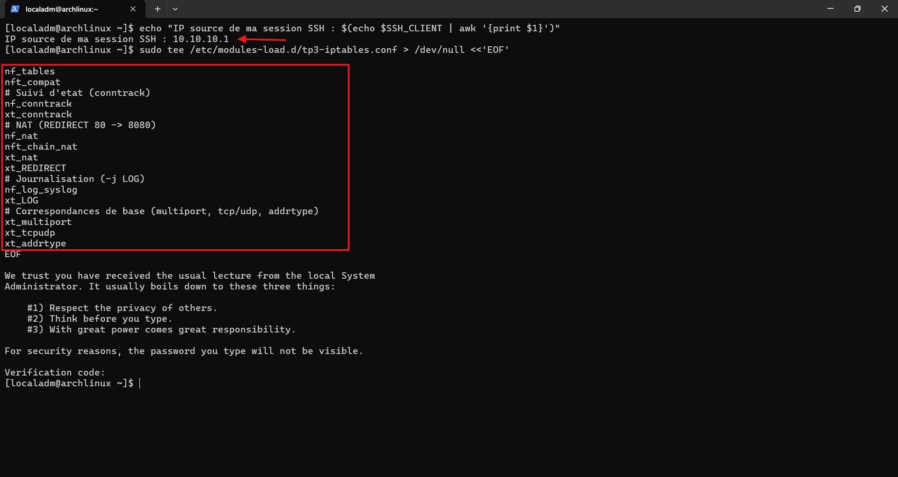

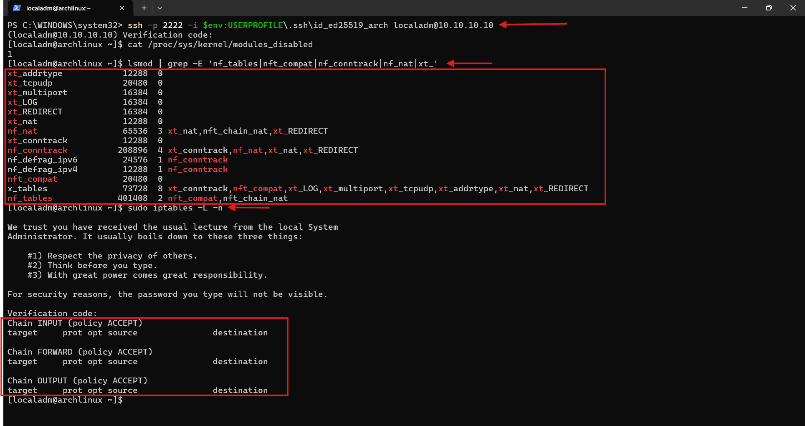

### 8.3 Le jeu de règles

**But :** écrire un jeu de règles complet répondant à l'énoncé : politique `DROP` par défaut, filtrage précis en entrée/sortie, redirection 80→8080, et journalisation intégrale avec entêtes distincts.

**Choix justifiés :** je décris tout dans un fichier `iptables-restore` (`/etc/iptables/iptables.rules`), le format même que le service de boot rechargera — je teste donc exactement ce qui tournera. Deux **chaînes de journalisation** dédiées, `LOG_ACCEPT` et `LOG_DROP`, tracent chaque décision avec son entête (`[IPTABLES-ACCEPT]` / `[IPTABLES-DROP]`) avant d'accepter ou de jeter. La règle SSH n'autorise le port `2222` que **depuis la machine d'administration `10.10.10.1`**.

```
*nat
:PREROUTING ACCEPT [0:0]
# Redirection du port 80 vers le port 8080 local
-A PREROUTING -p tcp --dport 80 -j REDIRECT --to-ports 8080
COMMIT

*filter
:INPUT DROP [0:0]
:FORWARD DROP [0:0]
:OUTPUT DROP [0:0]
:LOG_ACCEPT - [0:0]
:LOG_DROP - [0:0]
-A LOG_ACCEPT -j LOG --log-prefix "[IPTABLES-ACCEPT] "
-A LOG_ACCEPT -j ACCEPT
-A LOG_DROP -j LOG --log-prefix "[IPTABLES-DROP] "
-A LOG_DROP -j DROP
# ---- ENTREE ----
-A INPUT -i lo -j LOG_ACCEPT
-A INPUT -m conntrack --ctstate INVALID -j LOG_DROP
-A INPUT -m conntrack --ctstate ESTABLISHED,RELATED -j LOG_ACCEPT
-A INPUT -p icmp -m conntrack --ctstate NEW -j LOG_DROP
-A INPUT -p tcp --dport 8080 -m conntrack --ctstate NEW -j LOG_ACCEPT
-A INPUT -p tcp --dport 443  -m conntrack --ctstate NEW -j LOG_ACCEPT
-A INPUT -s 10.10.10.1/32 -p tcp --dport 2222 -m conntrack --ctstate NEW -j LOG_ACCEPT
-A INPUT -j LOG_DROP
# ---- SORTIE ----
-A OUTPUT -o lo -j LOG_ACCEPT
-A OUTPUT -m conntrack --ctstate INVALID -j LOG_DROP
-A OUTPUT -m conntrack --ctstate ESTABLISHED,RELATED -j LOG_ACCEPT
-A OUTPUT -p icmp --icmp-type echo-request -m conntrack --ctstate NEW -j LOG_ACCEPT
-A OUTPUT -p icmp -m conntrack --ctstate NEW -j LOG_DROP
-A OUTPUT -p udp --dport 53 -m conntrack --ctstate NEW -j LOG_ACCEPT
-A OUTPUT -p tcp --dport 53 -m conntrack --ctstate NEW -j LOG_ACCEPT
-A OUTPUT -p tcp --dport 443 -m conntrack --ctstate NEW -j LOG_ACCEPT
-A OUTPUT -j LOG_DROP
COMMIT
```

**Explication des points clés :**

- **Politique `DROP`** sur `INPUT`, `FORWARD` et `OUTPUT` : tout ce qui n'est pas explicitement autorisé est jeté.
- **Entrée** : la boucle locale est autorisée ; les paquets `INVALID` jetés ; les **réponses** (`ESTABLISHED,RELATED`) autorisées — c'est ce qui **maintient la session SSH en vie** lors de l'application ; les **nouveaux** ICMP jetés ; le web autorisé sur **8080** (le port 80 y arrive après redirection) et **443** ; le SSH autorisé **uniquement depuis `10.10.10.1`** ; tout le reste jeté avec log.
- **Sortie** : symétrique, avec l'ICMP `echo-request` autorisé (ping sortant) mais les autres nouveaux ICMP jetés, plus le DNS (53) et le HTTPS (443) sortants.
- **NAT** : `REDIRECT --to-ports 8080` réécrit, avant routage, toute arrivée sur le port 80 vers le 8080 local.
- **Note fonctionnelle :** l'énoncé n'énumère pas explicitement le 443 en entrée, mais le service HTTPS ne serait pas joignable sans lui ; je l'ai donc autorisé pour rendre le service réellement fonctionnel, ce que je signale.

**Documentation :** https://wiki.archlinux.org/title/Iptables et https://wiki.archlinux.org/title/Simple_stateful_firewall

### 8.4 Application à chaud et tests fonctionnels

**But :** appliquer les règles **sans se verrouiller**, puis prouver que le pare-feu laisse passer ce qu'il doit et bloque le reste.

**Choix justifiés :** la session SSH courante étant déjà `ESTABLISHED`, la règle « réponses connues autorisées » la préserve même en cas de mauvaise règle. J'applique donc à chaud, je vérifie que ma session survit, puis je teste **une nouvelle** connexion et le web depuis la machine d'administration, en gardant la console Hyper-V en dernier recours.

```bash
sudo iptables-restore < /etc/iptables/iptables.rules && echo "== REGLES APPLIQUEES =="
sudo iptables -L -n -v --line-numbers
```

**Preuves obtenues :** depuis la machine d'admin, une **nouvelle** connexion SSH sur `2222` aboutit ; `curl.exe -I http://10.10.10.10/` renvoie `301` puis `Location: https://…` (la redirection réseau 80→8080 **et** la redirection applicative fonctionnent ensemble) ; `curl.exe -kI https://10.10.10.10/` renvoie `200 OK`, `Server: Apache`, sans `X-Powered-By`. Côté serveur, la sortie DNS+HTTPS est validée (`curl https://archlinux.org` → `200`).

**Documentation :** https://man.archlinux.org/man/iptables-restore.8

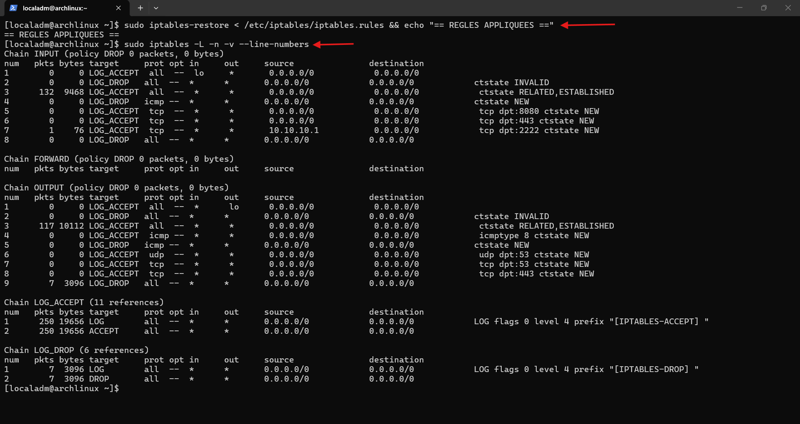

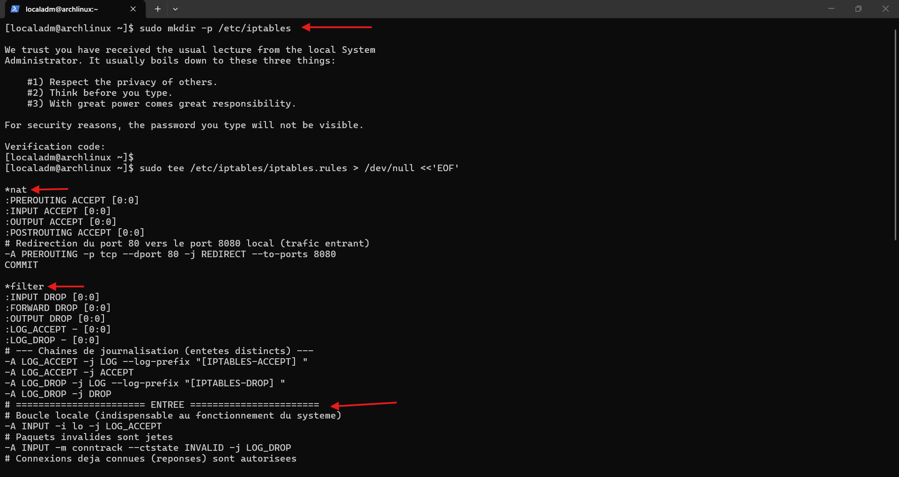

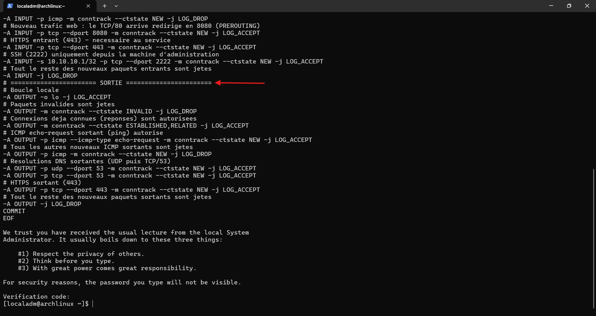

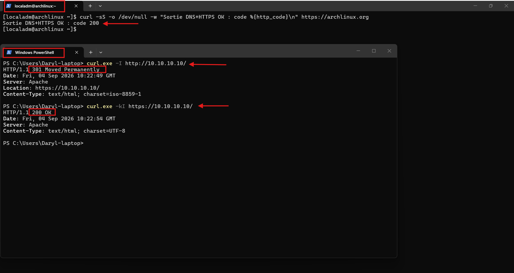

### 8.5 Incident : Apache ne démarre pas au boot (course avec `/data`)

**But :** comprendre et corriger l'échec d'`httpd` observé après un redémarrage.

**Constat :** après reboot, `httpd` est en `failed`. Le journal donne la cause exacte : `AH00526 … DocumentRoot '/data/http/www' is not a directory, or is not readable`. Le `DocumentRoot` étant sur le **volume chiffré `/data`**, déverrouillé tardivement au démarrage, Apache démarrait **avant** que `/data` ne soit monté et abandonnait. Détail révélateur du diagnostic : les compteurs des règles de pare-feu 8080/443 montraient bien du trafic — le pare-feu était donc innocent, c'était Apache le fautif.

**Correctif — faire attendre le volume à Apache :** j'ajoute un drop-in systemd qui déclare la dépendance de montage.

```ini
# /etc/systemd/system/httpd.service.d/tp3-wait-data.conf
[Unit]
RequiresMountsFor=/data/http/www
After=php-fpm.service
Wants=php-fpm.service
```

**Explication :** `RequiresMountsFor=/data/http/www` fait déduire à systemd l'unité de montage `data.mount` et ajoute automatiquement un `Requires=` **et** un `After=` dessus : Apache ne démarre donc **qu'après** le déchiffrement et le montage de `/data`. C'est, une fois de plus, un problème d'**ordonnancement** au démarrage, cousin de l'incident `dm_crypt` du TP2. Après correctif, `httpd` remonte tout seul au boot.

**Documentation :** https://man.archlinux.org/man/systemd.unit.5

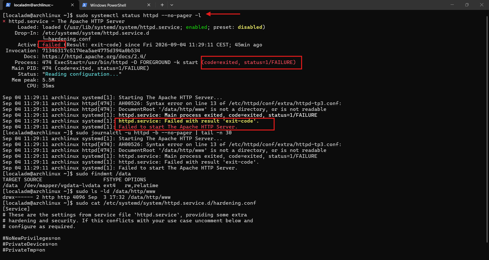

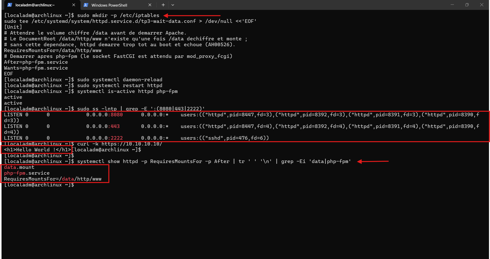

### 8.6 Journalisation `[IPTABLES-ACCEPT]` / `[IPTABLES-DROP]`

**But :** prouver que **tous** les flux (autorisés et jetés) sont journalisés avec des entêtes distincts.

**Test :** je provoque un flux jeté — un `ping` depuis la machine d'admin, que la règle « nouveaux ICMP entrants → jetés » doit rejeter — puis je lis le journal du noyau.

```bash
# depuis Windows : ping 10.10.10.10  -> 4 "Request timed out"
sudo journalctl -k --since "3 min ago" | grep 'IPTABLES-DROP' | tail
sudo journalctl -k --since "3 min ago" | grep 'IPTABLES-ACCEPT' | tail
```

**Explication :** le journal montre des lignes préfixées **`[IPTABLES-DROP]`** avec `PROTO=ICMP TYPE=8 SRC=10.10.10.1` (le ping jeté, corrélé aux 4 paquets perdus côté Windows) et des lignes **`[IPTABLES-ACCEPT]`** `PROTO=TCP DPT=2222` (le trafic SSH autorisé). Les deux entêtes sont bien distincts et couvrent les deux types de décision.

**Documentation :** https://man.archlinux.org/man/iptables-extensions.8

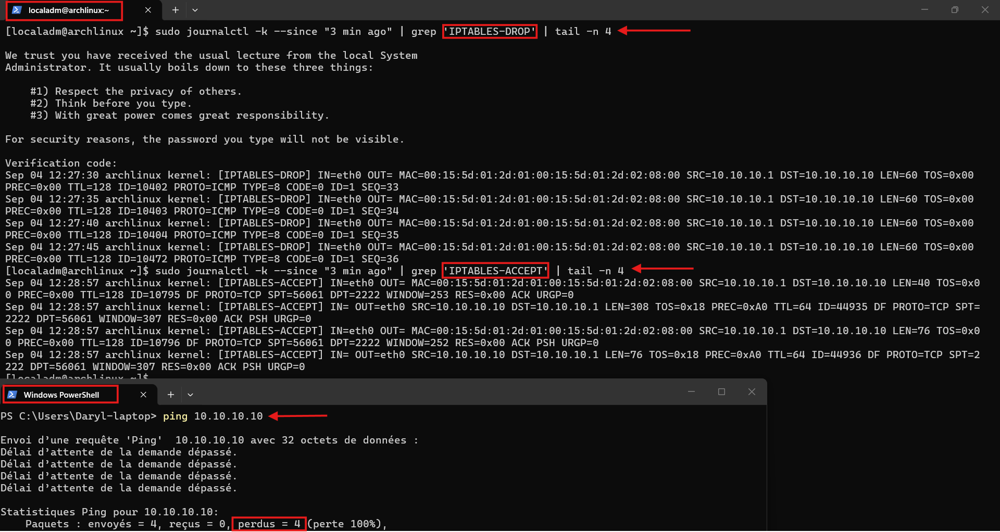

### 8.7 Persistance au boot et fermeture de l'IPv6

**But :** lancer le pare-feu **en service** au démarrage, et, par cohérence avec l'exigence « IPv4 uniquement », fermer totalement l'IPv6.

**Choix justifiés :** j'active `iptables.service` (fourni par le paquet `iptables`), qui restaure `/etc/iptables/iptables.rules` au boot ; comme les modules sont préchargés très tôt, la restauration réussit **malgré** le verrou `modules_disabled`. Aucun ordonnancement spécial n'est nécessaire : `iptables-restore` n'a plus de module à charger, tout étant déjà en mémoire. En parallèle, je fige un `ip6tables.rules` en politique `DROP` totale (seule la boucle locale est admise) et j'active `ip6tables.service`, ce qui verrouille l'IPv6.

```bash
sudo systemctl enable iptables ip6tables
```

**Explication :** après le redémarrage final, `iptables -S` réaffiche l'intégralité des règles (politiques `DROP`, chaînes de log, règle SSH depuis `10.10.10.1`), `ip6tables -S` montre l'IPv6 en `DROP`, et les quatre services (`iptables`, `ip6tables`, `httpd`, `php-fpm`) sont `active` — `httpd` remontant seul grâce au drop-in `RequiresMountsFor`.

**Documentation :** https://wiki.archlinux.org/title/Iptables#Configuration_and_usage

---

## 9. Réduction de la surface d'écoute (les 3 ports)

**But :** n'avoir, en fin de configuration, que **3 ports en écoute sur `0.0.0.0`**, et **uniquement en IPv4** (`netstat -lntuop`).

**Constat :** une fois les services en place, le `netstat` montrait bien les 3 ports TCP attendus (`2222`, `8080`, `443`)… mais **deux écoutes parasites** subsistaient : `udp 0.0.0.0:5353` et `udp6 :::5353`, ouvertes par `systemd-resolved` pour le **mDNS** (résolution multicast locale) — un 4ᵉ port sur `0.0.0.0` **et** une écoute IPv6, violant les deux conditions.

**Choix et démarche :** j'ai d'abord tenté la voie propre (`MulticastDNS=no` côté `resolved`, puis côté lien `systemd-networkd` avec `reconfigure`). Le mDNS de l'interface s'est bien coupé, mais la socket restait ouverte : sur cette version de systemd, `resolved` **réactive** son écoute mDNS via ses sockets d'activation (`systemd-resolved-varlink.socket`, `-monitor.socket`). Ce serveur n'ayant **aucun besoin** du résolveur local (le réseau pointe déjà un DNS direct), j'ai retenu la solution définitive : **désactiver entièrement `systemd-resolved`** — réduction de surface d'attaque parfaitement légitime — et figer un `/etc/resolv.conf` statique.

```bash
sudo systemctl mask systemd-resolved.service
sudo systemctl disable --now systemd-resolved-varlink.socket systemd-resolved-monitor.socket
sudo systemctl stop systemd-resolved.service
printf 'nameserver 8.8.8.8\nnameserver 1.1.1.1\n' | sudo tee /etc/resolv.conf
# nsswitch : resoudre via le module dns classique, sans dependre de resolved
sudo sed -i 's/^hosts:.*/hosts: files dns myhostname/' /etc/nsswitch.conf
```

**Explication :** en masquant le service **et** en coupant ses sockets d'activation, plus rien ne peut rouvrir le `5353`. La résolution DNS bascule sur le module `nss` `dns`, qui lit directement `/etc/resolv.conf`. Résultat final : `netstat -lntuop` n'affiche plus que **les 3 ports TCP sur `0.0.0.0`**, en **IPv4 uniquement** — objectif atteint. Le détail de cette investigation (plusieurs couches de configuration successives) est relaté dans le journal.

**Documentation :** https://man.archlinux.org/man/systemd-resolved.service.8 et https://wiki.archlinux.org/title/Systemd-resolved

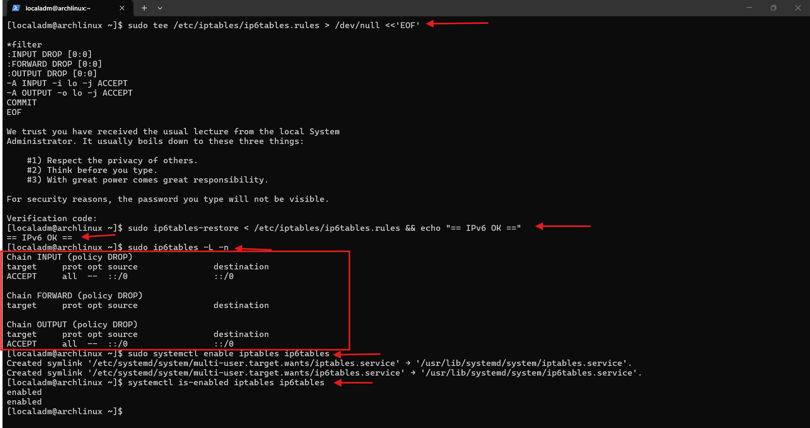

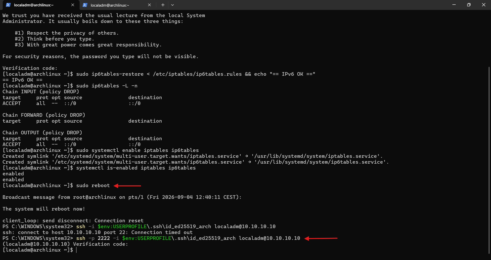

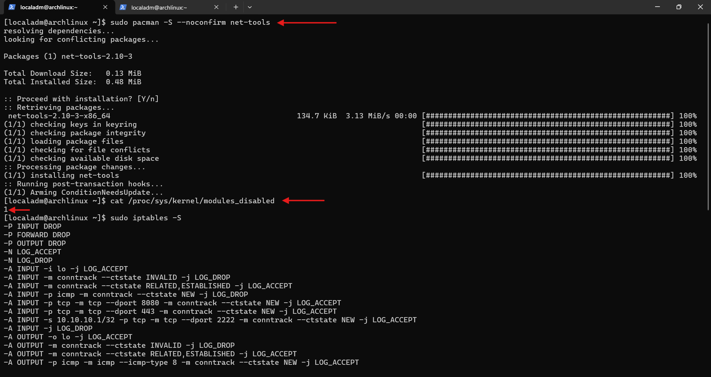

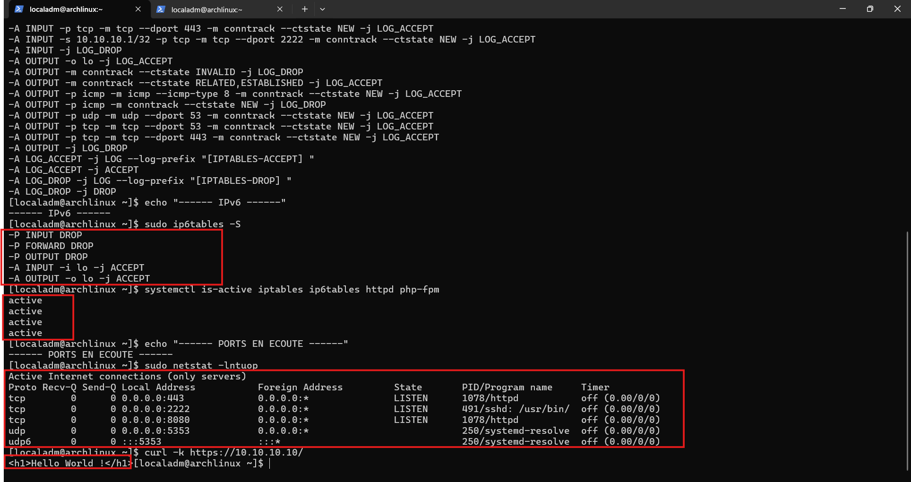

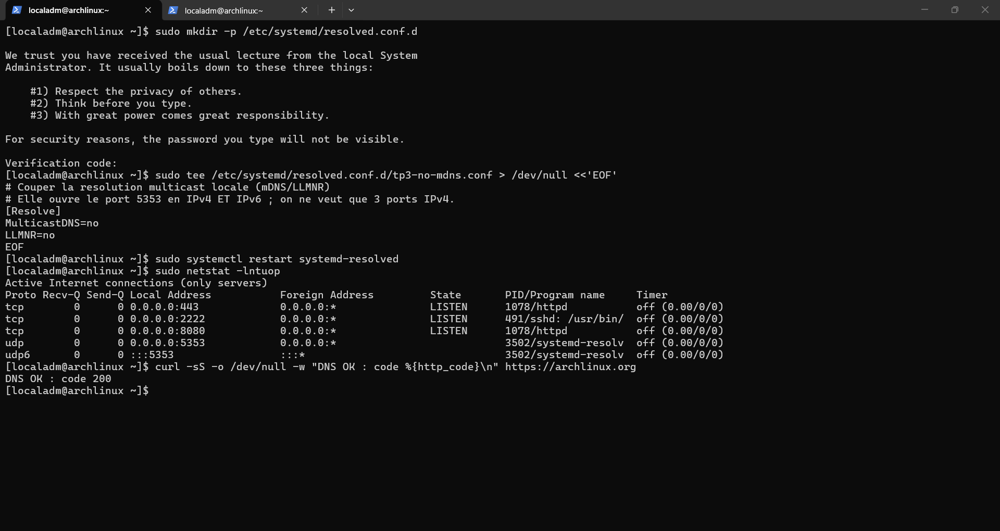

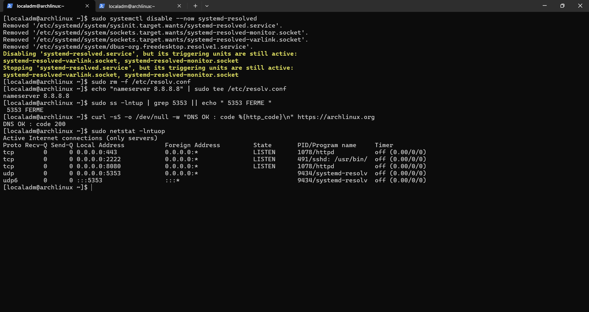

---

## 10. Validation finale

**But :** prouver que l'ensemble du niveau 3 survit à un redémarrage.

Après reboot, la batterie de contrôles confirme la persistance de tous les durcissements :

| Contrôle | Résultat attendu | Constaté |
|---|---|---|
| SSH sur le port `2222` (clé + OTP) | connexion possible depuis l'admin | OK |
| Blocage des modules noyau (TP2) | `1` | `kernel.modules_disabled = 1` |
| Modules netfilter préchargés | présents | `nf_tables`, `nft_compat`, `nf_nat`, `xt_*`… chargés |
| Règles iptables restaurées | politiques `DROP` + règles | `iptables -S` complet |
| IPv6 fermé | `DROP` | `ip6tables -S` en `DROP` |
| Services actifs | 4 `active` | `iptables`, `ip6tables`, `httpd`, `php-fpm` |
| Apache après reboot | remonte seul | `active` (grâce au drop-in `/data`) |
| Service en HTTPS | `Hello World` | `curl -k https://10.10.10.10/` OK |
| Ports en écoute | 3 sur `0.0.0.0`, IPv4 | `:2222`, `:8080`, `:443`, aucun IPv6 |

## 11. Bilan

À l'issue de ce niveau 3, la machine du TP2 devient un **serveur de service maîtrisé** : un accès SSH durci au-delà du 2FA (port déplacé, IPv4 seul, coupure rapide, aucun forwarding, crypto moderne), un service web **Apache/PHP-FPM en HTTPS** publié depuis le volume chiffré, avec redirection applicative et **aucune fuite de version**, et un **pare-feu iptables** à politique `DROP` par défaut, filtrant précisément entrée et sortie, redirigeant le port 80, **journalisant l'intégralité des flux**, lancé au boot et réduisant la surface d'écoute à **3 ports IPv4**. Chaque mesure a été testée, chaque difficulté comprise puis documentée dans le journal d'incidents — plusieurs incidents venant non d'une erreur de configuration, mais d'**interactions** avec les durcissements du TP2 (le blocage des modules face à iptables, le volume chiffré face au démarrage d'Apache). L'ensemble a été validé par un redémarrage complet.

> **Suite prévue :** deux configurations complémentaires demandées par l'encadrant — une **sonde de détection active `fail2ban`** et un **proxy `Squid`** — seront ajoutées sur une **seconde VM** dédiée, qui servira de proxy sortant à cette machine. Elles feront l'objet d'un complément à ce dépôt.

## 12. Livrables du dépôt

- `README.md` : ce document (tutoriel illustré, captures intégrées) — TP1-3 sur la machine principale et complément fail2ban/Squid sur la VM proxy (section 13).
- `JOURNAL-INCIDENTS.md` : le journal des incidents, avec cause et correctif (17 incidents au total).
- `Screenshots/` : les captures d'écran référencées, deux nomenclatures distinctes — `TP3-EtapeXX-NomTache.png` (machine principale) et `Proxy-EtapeAXX-NomTache.png` (VM proxy, section 13).
- `.gitignore` : exclut de la publication les PDF (l'énoncé `TP - Hardening Linux lvl 3.pdf` et les deux documents de référence `Sonde de détection Active - Fail2ban.pdf` / `Squid - Configuration Proxy.pdf`) ; tout le reste du dossier est publié.

## 13. Complément — Sonde active (fail2ban) et proxy sortant (Squid)

> Ce complément fait suite à la note de la section 11 : deux configurations demandées par l'encadrant — une sonde de détection active `fail2ban` et un proxy sortant `Squid` — sont mises en place sur une **seconde VM dédiée**, `squid-proxy` (`10.10.10.254`), sur le même réseau interne que la machine des TP1-3. Les captures de ce complément suivent leur propre nomenclature, `Proxy-EtapeAXX-NomTache.png`, pour rester distinctes de la séquence `TP3-EtapeXX`.

### 13.1 Contexte réseau

**But :** disposer d'une VM adressée sur le même réseau interne (`10.10.10.0/24`) que la machine du TP1-3, pour jouer le rôle de proxy sortant.

**Choix :** adressage statique `10.10.10.254/24`, passerelle `10.10.10.1` (la machine d'administration), DNS `8.8.8.8`, testé depuis l'ISO live avant toute installation (connectivité confirmée vers Internet ; le ping vers la passerelle elle-même est filtré côté admin, comportement attendu et déjà documenté au TP3).

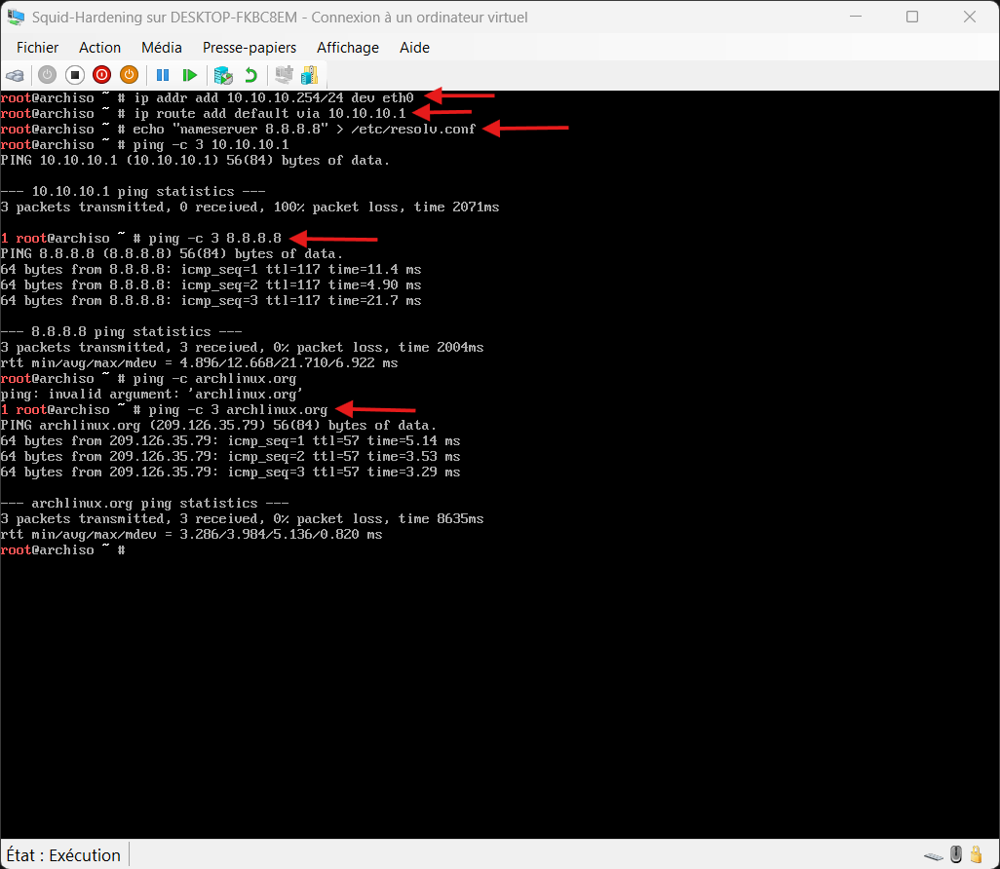

### 13.2 Installation d'Arch Linux sur la VM proxy

**Incident de départ :** la configuration initiale de fail2ban avait été faite directement sur l'**ISO live** (RAM), avant que je ne remarque, via le MOTD affiché après une connexion SSH, qu'aucune installation sur disque n'avait été faite — toute configuration aurait donc disparu au premier redémarrage. J'ai donc réalisé une installation Arch minimale sur cette VM avant de poursuivre (détail complet dans `JOURNAL-INCIDENTS.md`, incident #13).

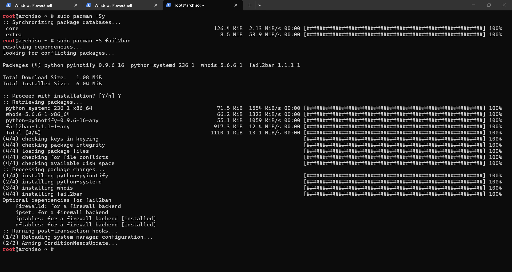
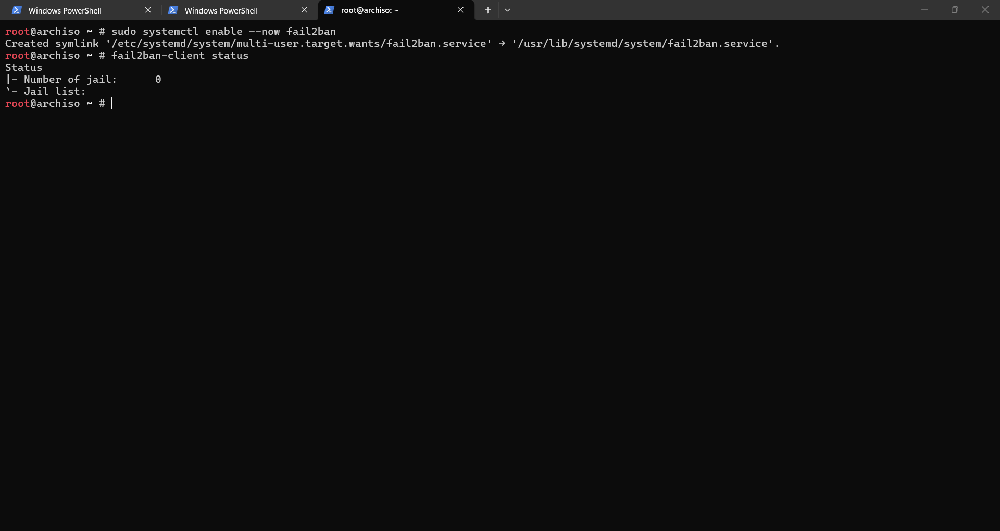
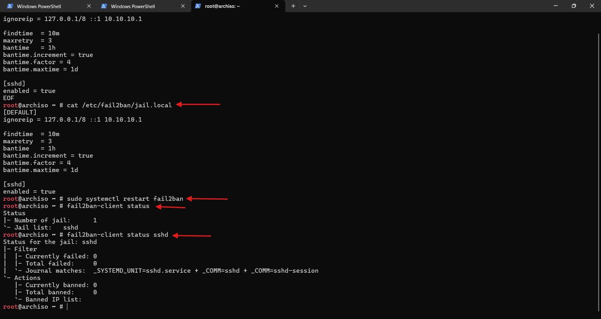

**Schéma retenu :** un disque unique de 20 Go (`/dev/sda`), partitionné en trois : EFI System (512 Mo), swap (1 Go), racine `ext4` (le reste). Plus simple que les TP1-3 : cette VM n'héberge pas de volume `/data` chiffré, n'a pas besoin de 2FA ni de partition USB dédiée — son unique rôle est de faire tourner Squid et fail2ban.

```bash
cfdisk /dev/sda
mkfs.fat -F32 /dev/sda1
mkswap /dev/sda2 && swapon /dev/sda2
mkfs.ext4 /dev/sda3
mount /dev/sda3 /mnt
mkdir -p /mnt/boot && mount /dev/sda1 /mnt/boot
pacstrap /mnt base linux linux-firmware sudo vim openssh
genfstab -U /mnt >> /mnt/etc/fstab
arch-chroot /mnt
```

Dans le chroot : fuseau horaire (`Europe/Paris`), locale `en_US.UTF-8`, hostname `squid-proxy`, mot de passe root, réseau statique persistant via `systemd-networkd` (même adressage que testé en live), `sshd` activé avec `PermitRootLogin yes` (nécessaire : cette VM reste en authentification par mot de passe, contrairement aux clés du TP1-3), puis GRUB en mode UEFI :

```bash
grub-install --target=x86_64-efi --efi-directory=/boot --bootloader-id=GRUB
grub-mkconfig -o /boot/grub/grub.cfg
```

**Validation :** après `exit`, `umount -R /mnt` et `reboot`, reconnexion SSH réussie sur `squid-proxy` — plus de MOTD live, le prompt affiche bien le hostname persisté.

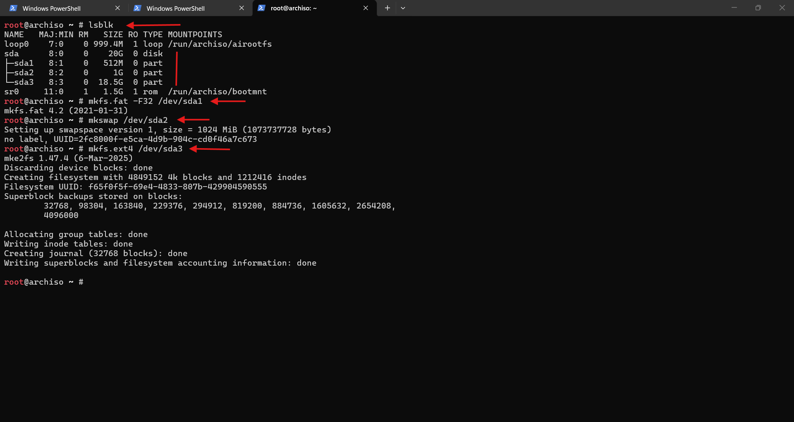
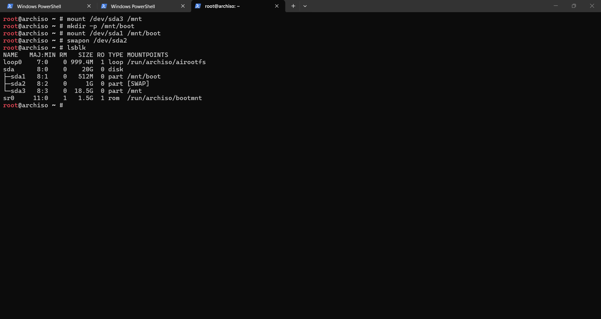
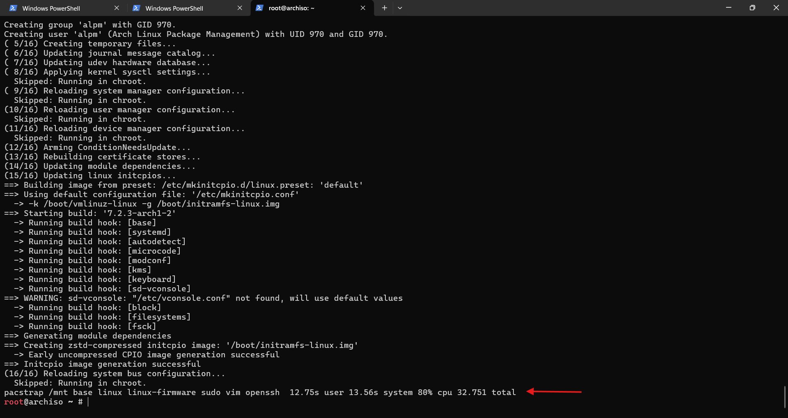
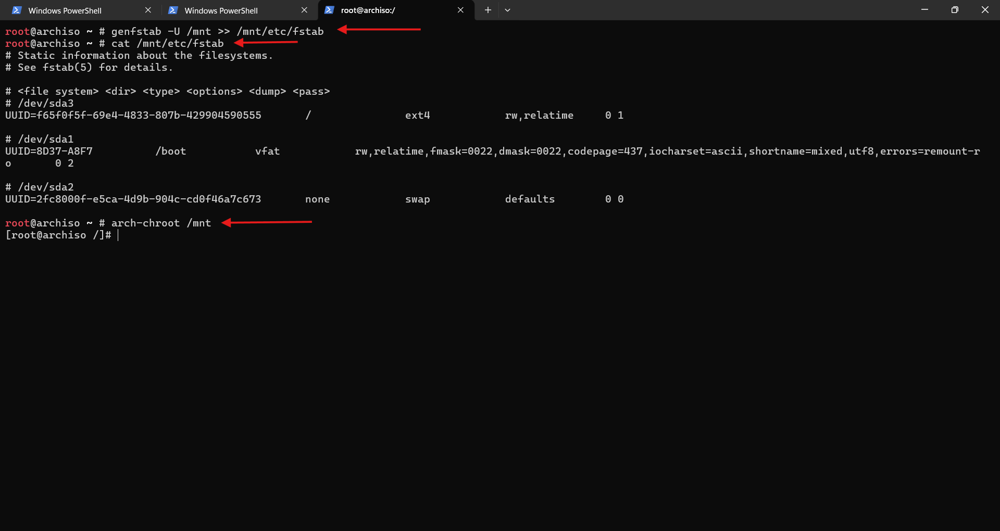
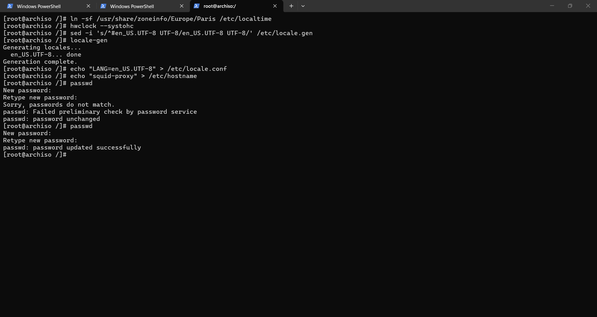
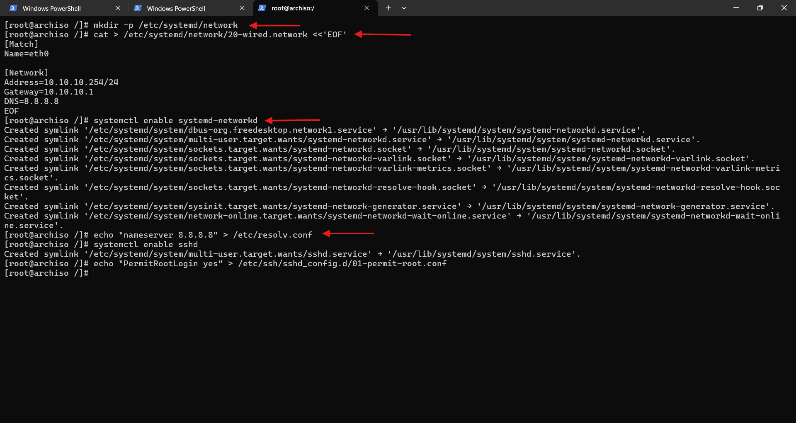
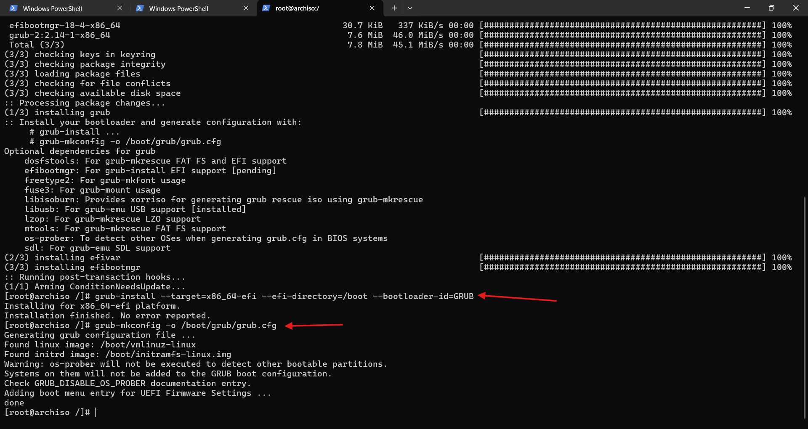

**Documentation :** https://wiki.archlinux.org/title/Installation_guide

### 13.3 Fail2ban — sonde active sur le service SSH

**But :** bannir temporairement toute IP multipliant les échecs d'authentification SSH sur cette VM.

**Incident :** au premier redémarrage, `pacman -Sy fail2ban` échouait (`Could not resolve host` sur tous les mirroirs) — `systemd-resolved`, bien que `disabled`, réinitialisait `/etc/resolv.conf` via ses sockets d'activation, exactement comme au TP3. Correctif identique : masquage du service + `/etc/resolv.conf` statique (incident #14, détaillé dans le journal).

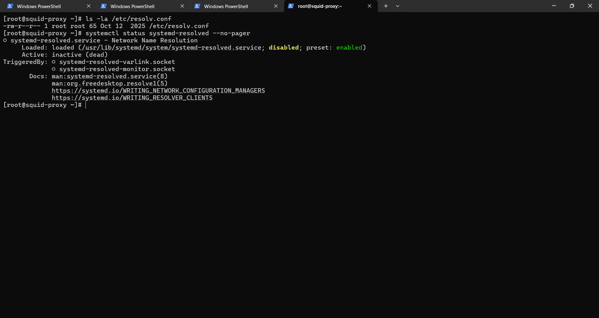
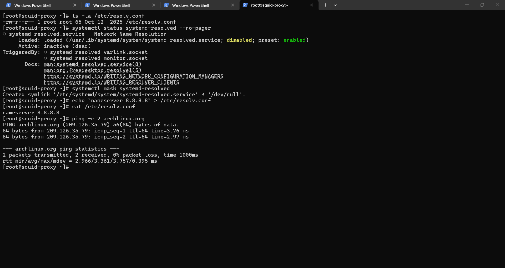

```bash
pacman -Sy fail2ban
systemctl enable --now fail2ban
```

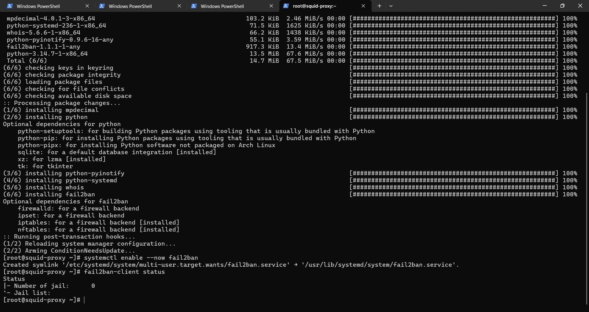

`/etc/fail2ban/jail.local` :

```ini
[DEFAULT]
ignoreip = 127.0.0.1/8 ::1 10.10.10.1
findtime  = 10m
maxretry  = 3
bantime   = 1h
bantime.increment = true
bantime.factor = 4
bantime.maxtime = 1d

[sshd]
enabled = true
```

**Explication des choix :** `maxretry = 3` (plus strict que le défaut de 5) et un `bantime` croissant (`bantime.increment`) qui multiplie la peine par 4 à chaque récidive, plafonnée à 24h — un compromis entre dissuasion et évitement d'un bannissement définitif sur une IP légitime qui se serait trompée une fois. `ignoreip` protège explicitement la machine d'administration (`10.10.10.1`) de tout bannissement accidentel, le même réflexe de prudence appliqué au SSH des niveaux précédents.

```bash
systemctl restart fail2ban
fail2ban-client status sshd
```

Résultat : jail `sshd` active, filtre qui surveille `sshd.service` via le journal (`_SYSTEMD_UNIT=sshd.service`), 0 échec et 0 ban au repos.

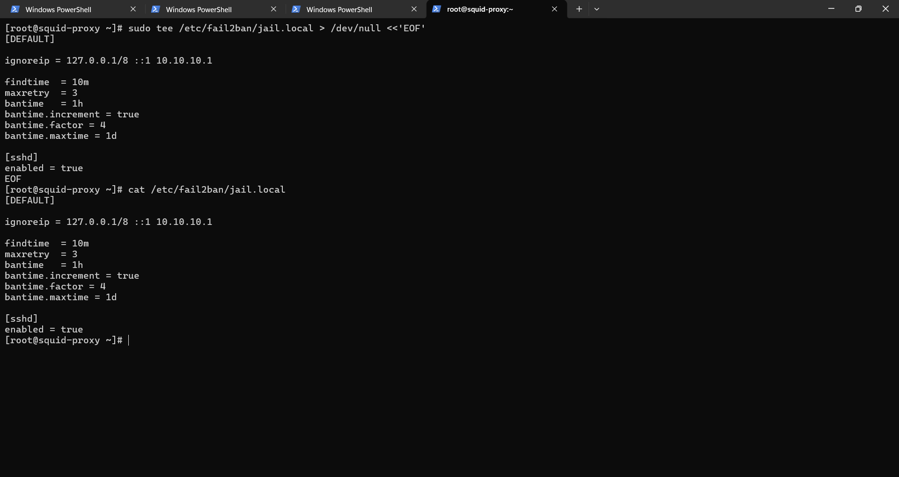
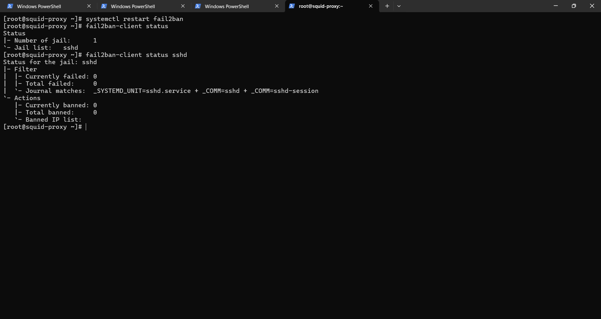

**Documentation :** https://wiki.archlinux.org/title/Fail2ban

### 13.4 Squid — proxy sortant et filtrage par liste de domaines

**But :** mettre en place un proxy HTTP/HTTPS sortant que la machine du TP1-3 pourra déclarer explicitement, avec un filtrage restreignant la sortie web à une liste de domaines autorisés.

**Étape 1 — validation du service (ACL ouverte) :**

```bash
pacman -S squid
sed -i '/^http_access deny all$/i http_access allow all' /etc/squid/squid.conf
echo "shutdown_lifetime 1 seconds" >> /etc/squid/squid.conf
systemctl enable --now squid
```

**Choix justifiés :** l'ACL d'autorisation est insérée **avant** la ligne `http_access deny all` déjà présente dans le fichier par défaut (Squid évalue ses règles dans l'ordre, la première correspondance l'emporte) plutôt que d'écraser tout le fichier — je conserve ainsi les ACL par défaut (`localhost`, `SSL_ports`, `Safe_ports`). Cette configuration ouverte n'est qu'une **étape de validation** ; le filtrage par liste de domaines suit immédiatement.

```bash
curl -I -x 127.0.0.1:3128 https://www.wikipedia.org/
```

`HTTP/1.1 200 Connection established` suivi d'un `HTTP/2 200` — le service fonctionne.

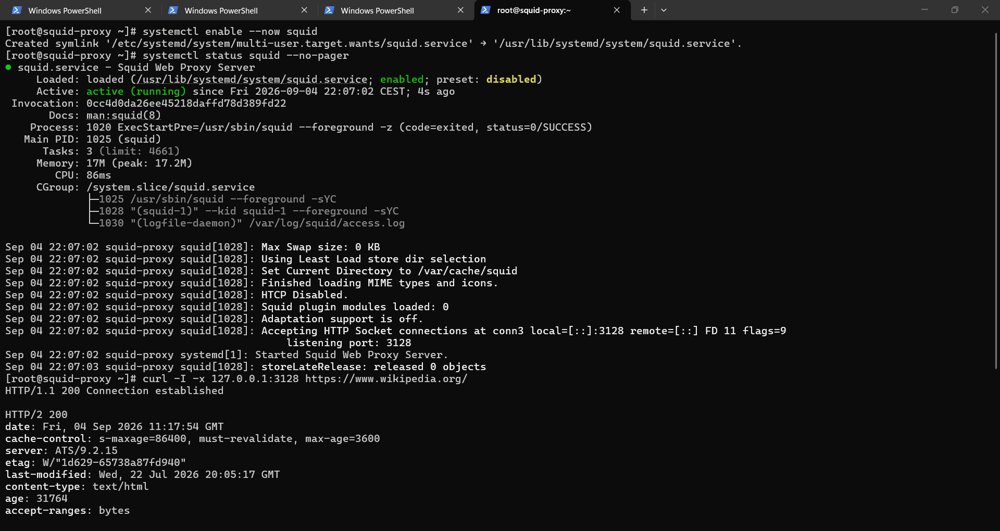

**Étape 2 — filtrage par liste de domaines :**

`/etc/squid/allowed-domains.conf` :

```
.archlinux.org
.wikipedia.org
```

```bash
sed -i '68i acl allowed_dst dstdomain "/etc/squid/allowed-domains.conf"' /etc/squid/squid.conf
sed -i '69i http_access allow allowed_dst' /etc/squid/squid.conf
systemctl restart squid
```

**Choix justifiés :** `dstdomain` avec un point en tête (`.wikipedia.org`) autorise le domaine **et** ses sous-domaines. L'ACL `allowed_dst` est insérée juste avant `http_access deny all`, qui continue donc à jouer son rôle de règle de refus par défaut pour tout le reste — seuls `archlinux.org` (dépôts/documentation Arch) et `wikipedia.org` (test neutre) passent, tout le reste, y compris `twitter.com`, est bloqué.

**Incident rencontré :** deux tentatives d'insertion par `sed` ancrées sur un motif (`/^http_access deny all$/i …`) ont échoué **silencieusement** — aucune erreur, mais le fichier restait inchangé, ce qui a d'abord masqué un faux « tout passe » (test via `127.0.0.1`, qui contourne le filtrage — voir ci-dessous) puis un faux « tout est bloqué » (l'ACL n'avait en réalité toujours pas été insérée). Le correctif a été de basculer sur une insertion **par numéro de ligne** (`sed -i '68i …'`), fiable, vérifiée par `grep -n` après coup. Détail complet : incident #15 du journal.

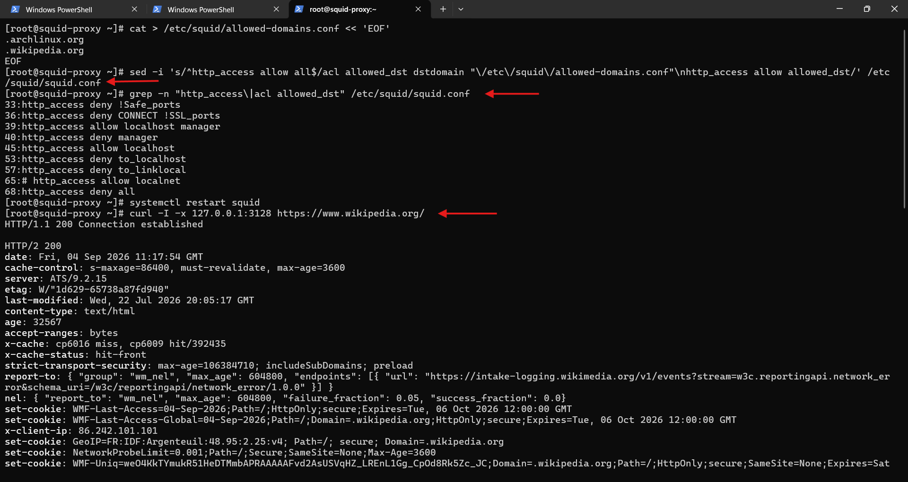
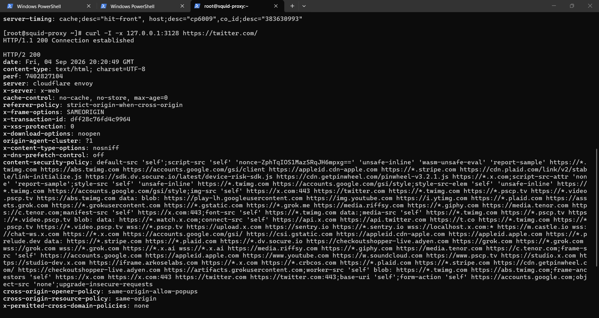
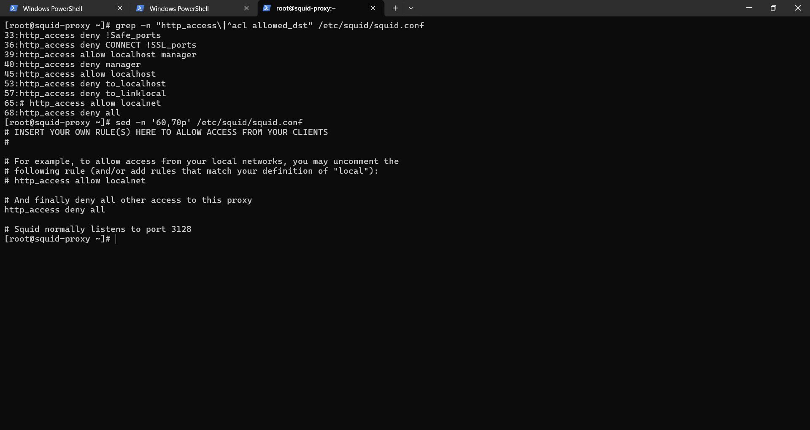
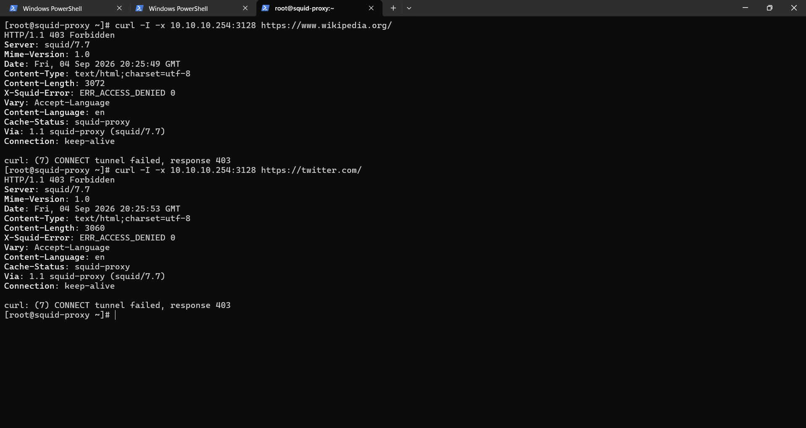
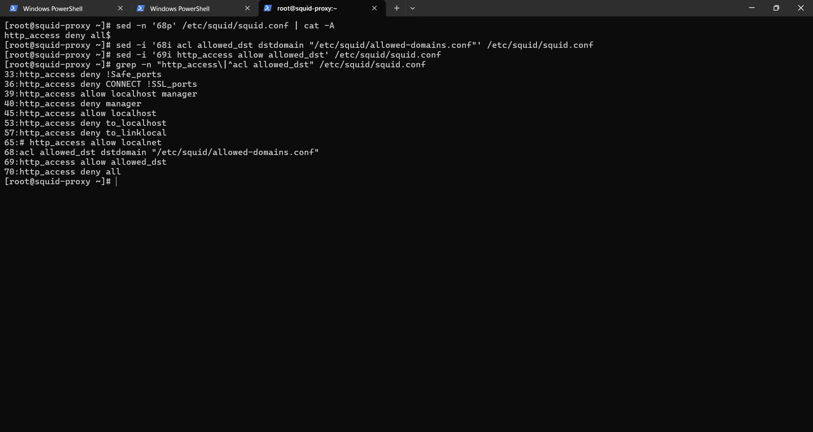

**Piège de méthodologie de test :** tester via `curl -x 127.0.0.1:3128 …` renvoie systématiquement `200`, quel que soit le domaine, car la configuration par défaut de Squid contient une règle `http_access allow localhost` (ACL `localhost` = `src 127.0.0.1/32 ::1`) évaluée **avant** toute règle personnalisée. Le test valide doit donc cibler l'IP réelle de l'interface du proxy (`10.10.10.254`), qui ne correspond pas à cette ACL. Détail complet : incident #16 du journal.

**Test final (depuis la VM proxy elle-même, via son IP réseau réelle) :**

```bash
systemctl restart squid
curl -I -x 10.10.10.254:3128 https://www.wikipedia.org/
curl -I -x 10.10.10.254:3128 https://twitter.com/
```

Résultat : `wikipedia.org` → `HTTP/2 200` (domaine autorisé) ; `twitter.com` → `HTTP/1.1 403 Forbidden`, en-tête `X-Squid-Error: ERR_ACCESS_DENIED 0` (domaine hors liste, correctement rejeté).

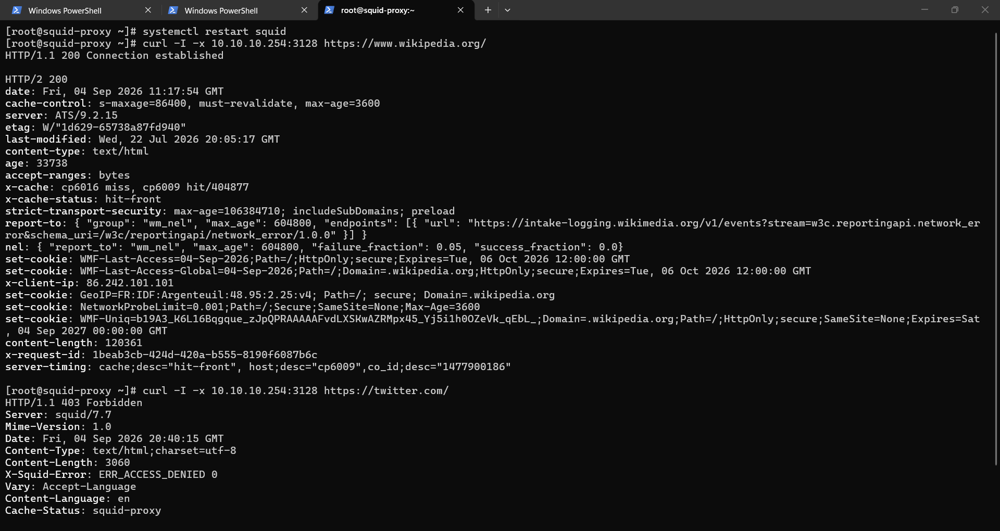

**Documentation :** https://wiki.archlinux.org/title/Squid

> **Suite immédiate :** le filtrage Squid est validé **localement sur VM2**. Il reste à ouvrir le pare-feu iptables de VM1 pour autoriser la sortie vers `10.10.10.254:3128`, puis à tester le proxy **depuis VM1** pour valider la chaîne complète de bout en bout. Cette partie sera complétée dès que VM1 sera de nouveau accessible.
